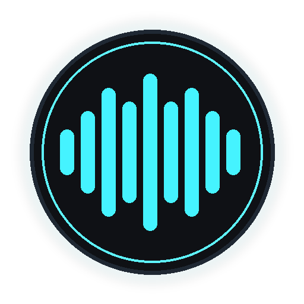
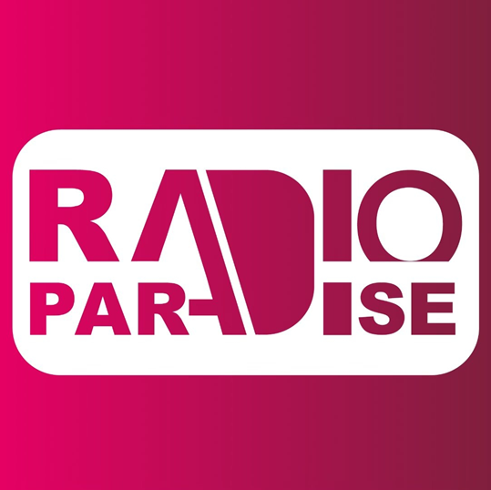
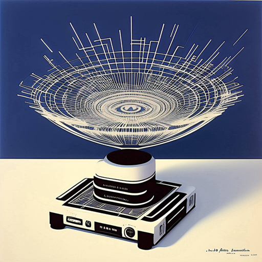
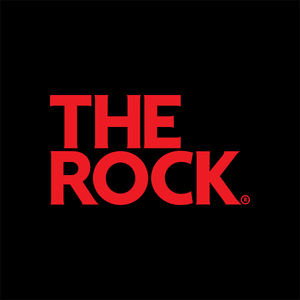

<p align="center">
  
</p>

<h1 align="center">Internet Radio</h1>

<p align="center">
  A neon-styled, self-hostable internet radio player for the web, Windows/Linux desktop, Docker, and Unraid.
</p>

<p align="center">
  <a href="#quick-start">Quick start</a> ·
  <a href="#features">Features</a> ·
  <a href="#self-hosting-with-docker">Docker</a> ·
  <a href="#third-party-content-and-trademarks">Disclosures</a>
</p>

---

## Preview

Internet Radio ships with a visual station library and supports custom station artwork.

<p align="center">
  
  &nbsp;&nbsp;
  
  &nbsp;&nbsp;
  
  &nbsp;&nbsp;
  
</p>

> Station names and logos above belong to their respective owners and are shown only to identify compatible streams. See [Third-party content and trademarks](#third-party-content-and-trademarks).

## What is Internet Radio?

Internet Radio is a personal radio dashboard built in two forms:

- A modern React/Vite web application, designed for browsers, self-hosting, and PWA installation.
- A feature-rich PyQt6 desktop application with native playback, stream recording, listening history, mini-player mode, and local data persistence.

The project includes a curated starter list of stations, but it is designed to be personalised with your own stream URLs, station names, icons, and local music folders.

## Features

### Radio playback and station library

- Play compatible MP3, AAC, OGG, HLS, and other browser/platform-supported radio streams.
- Bundled starter station list with recognisable station artwork.
- Add custom stations using a name and direct stream URL.
- Edit station URLs without rebuilding the application.
- Replace station artwork with your own local image.
- Hide stations you do not currently want displayed.
- Delete stations from the local library.
- Restore the most recently played station at startup.
- Automatic fallback artwork generated from station initials when a logo is unavailable.
- Previous/next station navigation and clear active-station highlighting.

### Two visual browsing modes

- Responsive tile/grid view for scanning the full station library.
- Animated cover-flow view with five-position station navigation.
- Mouse-wheel, keyboard, click, and touch/swipe navigation.
- Persistent view preference stored for the next visit.

### Stream information and artwork

- Reads available ICY stream metadata.
- Displays current artist and track information when supplied by the station.
- Fetches higher-resolution album artwork through the iTunes Search API in the desktop app.
- Derives an interface accent colour from the current station artwork in the web app.
- Graceful fallbacks for streams that do not expose metadata or artwork.

### Personalisation

- Automatic accent theme derived from station artwork.
- Built-in colour presets:
  - Cyan Neon
  - Emerald Matrix
  - Amber Retro
  - Hot Pink
  - Sunset Orange
  - Purple Velvet
  - Midnight Blue
  - Slime Green
- Optional animated visual effects:
  - Warp Speed
  - Kinetic Sparks
  - Digital Rain
- Persistent volume, mute, theme, animation, station, and layout preferences.
- Desktop support for custom saved theme presets.

### Local music-folder radio

- Select a local music directory and turn it into a temporary personal station.
- Recursively discovers supported audio files in subfolders.
- Supports common formats including MP3, M4A, AAC, OGG, Opus, WAV, FLAC, and WebM where the platform supports them.
- Alphabetically orders discovered tracks.
- Previous/next local-track controls.
- Folder access remains subject to browser permissions; browser-created folder stations are session-based.

### Desktop-only features

- Native PyQt6 interface and multimedia playback.
- Record the currently playing live stream to timestamped MP3 files.
- Browse, play, delete, and open the recordings directory.
- Listening history with time, station, and track title.
- Compact mini-player with artwork, mute, previous/next station, and restore controls.
- Adjustable sidebar and player layout.
- Tile and cover-flow station views.
- Persistent station order, application settings, custom logos, recordings, window size, and position.
- Drag-and-drop aware desktop controls.
- Local-file playback through the native media engine.

### Web and PWA features

- Responsive React 19 interface.
- Vite development and production builds.
- Installable web-app manifest.
- Lightweight service worker for core static assets.
- Touch-friendly cover-flow controls.
- Browser-local persistence through `localStorage`.
- Responsive mobile layout and maskable PWA icons.

### Self-hosting and deployment

- Production Nginx container for the React web app.
- Docker Compose configuration for quick deployment.
- Unraid-compatible deployment workflow.
- Optional PyQt/noVNC container for accessing the desktop interface through a browser.
- Persistent Docker volume for desktop settings, station order, custom logos, and recordings.
- Nginx proxy route for the included SUB/WAVE stream configuration.
- Works behind a reverse proxy, subject to the stream providers' CORS, mixed-content, and playback policies.

## Project structure

| Path | Purpose |
| --- | --- |
| `web/` | React/Vite web app and PWA assets |
| `web/src/App.jsx` | Main web interface and playback logic |
| `web/src/stations.js` | Bundled web station list |
| `main.pyw` | Desktop application entry point |
| `ui.py` | PyQt6 desktop interface |
| `radio_engine.py` | Desktop playback, metadata, artwork, and recording logic |
| `config.py` | Default desktop stations and settings |
| `logos/` | Bundled station artwork |
| `Dockerfile.web` | Production web image |
| `docker-compose.web.yml` | Recommended web deployment |
| `Dockerfile` | PyQt/noVNC desktop image |
| `docker-compose.yml` | Desktop/noVNC deployment |
| `SELFHOSTING-WEB.md` | Detailed web and Unraid instructions |
| `SELFHOSTING.md` | Detailed desktop/noVNC instructions |

## Quick start

### Web app for development

Requirements:

- Node.js 20 or newer
- npm

```bash
cd web
npm install
npm run dev
```

Open [http://localhost:5173](http://localhost:5173).

Create a production build with:

```bash
npm run build
```

The generated site is written to `web/dist/`.

### Desktop app

Requirements:

- Python 3.10 or newer
- PyQt6
- Platform multimedia codecs required by the streams you use

```bash
python -m venv .venv
```

Activate the virtual environment:

```powershell
.\.venv\Scripts\Activate.ps1
```

On Linux or macOS:

```bash
source .venv/bin/activate
```

Install and run:

```bash
pip install -r requirements.txt
python main.pyw
```

## Self-hosting with Docker

### Recommended: React web application

The web container builds the Vite application and serves it through Nginx.

Files:

- [`Dockerfile.web`](Dockerfile.web)
- [`docker-compose.web.yml`](docker-compose.web.yml)
- [`web-nginx.conf`](web-nginx.conf)
- [Full web and Unraid guide](SELFHOSTING-WEB.md)

Start it from the repository root:

```bash
docker compose -f docker-compose.web.yml up -d --build
```

Then open:

```text
http://YOUR-SERVER-IP:8080
```

For an Unraid deployment, copy the project to an appdata directory such as:

```text
/mnt/user/appdata/internet-radio/
```

Add `docker-compose.web.yml` in Compose Manager and deploy the stack. Web preferences are stored in each browser's `localStorage`, so every browser/device can have its own layout, theme, volume, and custom station configuration.

### Alternative: PyQt desktop through noVNC

The desktop container runs the PyQt application inside a virtual display and exposes it through noVNC.

Files:

- [`Dockerfile`](Dockerfile)
- [`docker-compose.yml`](docker-compose.yml)
- [Full desktop/noVNC guide](SELFHOSTING.md)

Start it with:

```bash
docker compose up -d --build
```

Then open:

```text
http://YOUR-SERVER-IP:6080/vnc.html?autoconnect=true&resize=remote
```

Desktop runtime state is kept in the `radio_data` volume:

- `/data/settings.json`
- `/data/station_order.json`
- `/data/logos`
- `/data/recordings`

> Browser audio forwarding from a Linux desktop container depends on the Docker host's PulseAudio/PipeWire setup. Use the React web container when straightforward browser playback is the priority.

## Adding or changing stations

### In the interface

Open the options panel to:

- Add a station name and direct stream URL.
- Create a station from a local music folder.
- Hide, edit, or delete an existing station.
- Select a replacement icon.

These changes are stored locally and do not modify the source repository.

### In the source

Web defaults are defined in:

```text
web/src/stations.js
```

Desktop defaults are defined in:

```text
config.py
```

Only include streams you are permitted to access and redistribute. Stream URLs can expire, change format, become geographically restricted, require authentication, or prohibit third-party embedding.

## Known limitations

- Browser codec support varies by operating system and browser.
- HTTP streams may be blocked when the app itself is served over HTTPS because of mixed-content rules.
- A station may prohibit cross-origin browser playback even if its stream works in a native player.
- Metadata availability is controlled by each stream provider.
- HLS metadata support differs from ICY metadata support.
- Stream addresses and station availability can change without notice.
- Browser folder stations are session-based because local file handles and object URLs are not permanently portable.
- noVNC desktop audio requires host-specific audio configuration.

## Privacy

Internet Radio has no project-operated account system or analytics service.

- Web preferences and custom stations are stored in the browser.
- Desktop settings, history, logos, and recordings are stored locally or in the configured Docker volume.
- Playback connects directly to the selected station/stream provider.
- Desktop artwork lookup sends a track search query to Apple's iTunes Search API.
- Station providers, reverse proxies, hosting platforms, and Apple may process network information according to their own policies.

## Third-party content and trademarks

The MIT License applies to the original source code in this repository. It does **not** grant rights to third-party station names, logos, trademarks, programme content, music, broadcasts, stream URLs, metadata, or artwork.

Bundled station logos are included solely to identify their respective stations in the player. All station names, logos, and trademarks remain the property of their respective owners. Their inclusion does not imply sponsorship, endorsement, affiliation, or permission to redistribute them in another product.

The bundled station list is provided as a convenience. This project does not host, own, rebroadcast, or guarantee the listed third-party streams. Each stream remains under the control and terms of its provider. Users and redistributors are responsible for verifying stream availability, geographical restrictions, applicable licences, provider terms, and permission to use or distribute logos and station data.

For the full disclosure and removal/contact guidance, read [THIRD_PARTY_NOTICES.md](THIRD_PARTY_NOTICES.md).

## Licence

The original software is released under the [MIT License](LICENSE).

Third-party media, station branding, and service content are excluded from that grant unless their respective owner expressly states otherwise.

## Contributing

Bug fixes and improvements are welcome. Please avoid submitting:

- Unlicensed logos or artwork.
- Private, authenticated, or access-controlled stream URLs.
- Streams that prohibit embedding or redistribution.
- Credentials, private network addresses, or personal server details.

When adding a station, document its official source and verify that its stream is intended for public listening.
